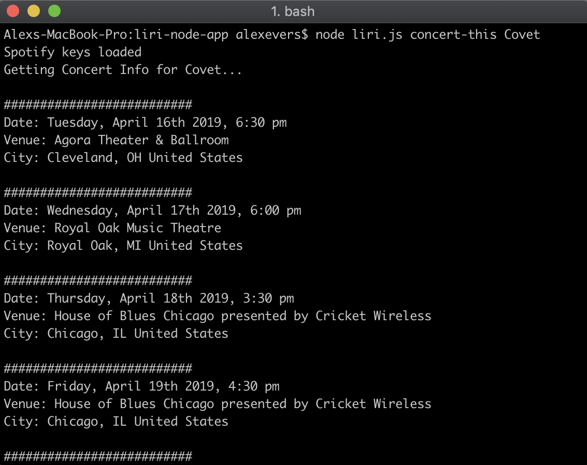

# liri-node-app

LIRI, a Language Interpretation and Recognition Interface, is a Command Line Node.js app that retrieves data related to movies and music, including upcoming tour dates for your favorite artists. It accepts 4 main commands: `concert-this`, `movie-this`, `spotify-this-song`, and `do-what-it-says`. Each of these commands can be followed by additional search terms to bring back relevant data and information.

## Concert-this 
The `concert-this` command uses Axios and the Bands-in-Town API to search for upcoming tour dates of a specified artist.

Concert-this requires the following syntax: `node liri.js concert-this <artist to search>`. Please see the example below for additional information.

Here you can see a concert-this command searching for the math-rock band 'Covet'...

... which returns this data. As you can see, it brings back dates, venues, and locations of Covet's upcoming shows.

### Concert-this Error Messaging
What happens if the artist in question has no upcoming shows? If the artist exists in the system but doesn't return any shows, LIRI displays this message:

If the user enters an artist not found in the system (or a random string of characters), LIRI will display this message:

If the user calls the `concert-this` command without specifying an artist to search for, LIRI will remind the user to include an artist in their search:

## Spotify-this-song
The `spotify-this-song` takes in a song title and returns search results from the Spotify Node API.

Please use the following syntax for the spotify-this-song command: `node liri.js spotify-this-song '<song title>'`. Note that for this command, unlike concert-this, the search term will need to be wrapped in quotes. For example:

As shown in the screenshot, LIRI returns the Artist, Title, Album, and Audio Preview URL for each matching search result.

### Spotify-this-song Error Messaging 
Sometimes the audio preview for a specific song is unavailable. To preserve the rest of the search, LIRI can handle that response and print the following message:

If the user enters a song that returns no results, LIRI displays this message:

Finally, if the user calls `spotify-this-song` without entering a song, LIRI will default to search for 'The Sign' by Ace of Bass:

## Movie-this
The `movie-this` command uses an Axios call to search the OMDB API for relevant movie data. This command requires the following syntax: `node liri.js movie-this '<Movie title>'`. Like the `spotify-this-song` command, the title of the movie must be wrapped in quotes.

Example: 

This command will display the movie's:
* Title
* Release Year
* IMDB Rating
* Rotten Tomatoes Rating
* Country of Origin
* Plot Summary
* Starring Actors

### Movie-this Error Messaging
If the user enters a movie that doesn't exist is the OMDB database (or enters some random characters), LIRI will display this message:

If the user calls the `movie-this` command without entering a movie, LIRI will default to a search for 'Mr. Nobody.'

## Do-what-it-says
The `do-what-it-says` command reads text from another file, random.txt, and uses that information to run a search. In this case, random.txt contains the following text: `spotify-this-song,"I Want it That Way"`. LIRI reads and parses this text into a valid search term, then uses that search term to call the `spotify-this-song` command. In this current implementation, only one search may exist within random.txt, and only the `spotify-this-song` command is currently supported. For example:

This command does not accept any search terms of its own, since they're coming from random.txt. As such, any terms added after the command will be ignored.

